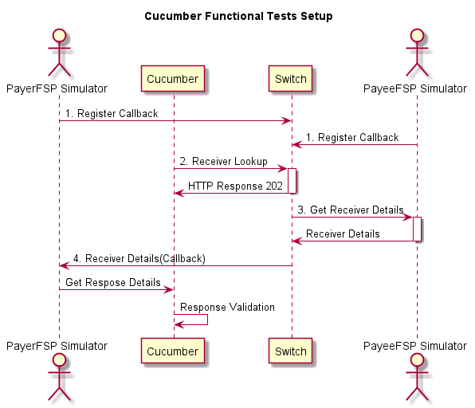

# Mojaloop Functional Testing

This repository holds the test cases for the different business features offered by Mojaloop.
The framework chosen to implement this automated testing is Cucumber and using Java as the underlying implementation language. 
The below section gives a brief overview on how Cucumber is used in this testing.

The 2 main files that you will see across these tests are 
 - Gherkin Features
 - Step Definitions.
 
**Gherkin Features:**

This is the first step where the business features that are provided by Mojaloop Application are 
captured in a language called Gherkin. The recommended approach is to create a separate Gherkin file per feature.
Each Gherkin feature file will be further having more scenarios describing different variations of the feature. 
Each scenario takes the form of a 

    Given - Provided these conditions exist
    When - an action is taken
    Then - these results should be expected
    
Illustrating the usage of a Gherkin scenario using a sample business feature, User lookup, in Mojaloop.

    Feature: User Lookup
        As a payer FSP
        I should be able to lookup for a receiver MSISDN
        So that I can proceed further in P2P Money Transfer
        
    Scenario: 
        Given the receiver is registered in the central lookup application
        When I do a lookup based on receiver MSISDN
        Then the switch should provide receiver details like name, DOB etc..
        

**Step Definitions:**

This is the second step where you provide the test case implementation of the Gherkin Features. For Mojaloop, we are using Cucumber-Java for this implementation. Without going into the 
finer details of Cucumber implementation, as a tester you will define logic for the Given/When/Then in 
the StepDefinition file. 

Using the above Gherkin scenario example, the below snipped of code from the StepDefinition illustrates the usage:

_UserLookupStepDefs.java_
```Java
@Given("^the receiver is registered in the central lookup application$")
public void receiverIsRegistered() throws Throwable {
    //Logic
}

@When("^I do a lookup based on receiver MSISDN \"([^"]*)\"$")
public void receiverLookup(String fsp, String msisdn, String fullName, String firstName, String lastName, String dob) throws Throwable {
    //Logic
}

@Then("^the switch should provide receiver details like name, DOB etc.$")
public void receiverDetails(String expectedName, String expectedDOB) throws Throwable {
    //Logic
}
```

Given this brief overview about Gherkin and how it is impleemnted in Cucumber, the following sections talk about Installing the required software to run these tests, Steps to run the tests and an overview of the reports that will be generated.
 
Contents:

- [Required Software](#required software)
- [Setup Overview](#setupoverview)
- [Running Tests](#runningtests)
- [Reports](#reports)

## Required Software

1. [JDK 1.8 or later](http://www.oracle.com/technetwork/java/javase/downloads/jdk8-downloads-2133151.html)
2. [Apache Maven](https://maven.apache.org/download.cgi)
3. Any IDE (Steps are included for Intellij and Eclipse)

    3.1 [Intellij Community/Ultimate Edition](https://www.jetbrains.com/idea/download/index.html#section=windows)
    
    - Please refer to this link [Cucumber support in Intellij](https://www.jetbrains.com/help/idea/bdd-frameworks.html) to Enable Cucumber support in Intellij using Maven.
    - If not enabled by default, go to File -> Settings -> File Types. Select Cucumber Scenario and in Registered Patterns add '.feature".
    
    3.2 [Eclipse](http://www.eclipse.org/downloads/) 
    
4. ngrok (Optional. If you plan to run test cases from laptop)

## SetupOverview
The below diagram represents the different components that are part of this testing setup.

 
 
 - _PayerFSP Simulator, PayeeFSP Simulator_: Mock Simulators that represent Payer and Payee FSPs that are used to receive the callbacks from Mojaloop switch and also to return default payer/payee details and quote responses.
    These simulators are developed using Spring Boot framework and are provisioned once the tests are started using maven.
 - _Cucumber_: Represents the Cucumber-Java Step Definitions that sends the requests to the Switch and query PayerFSP/PayeeFSP for the callback responses.
 - _Switch_: Represents Mojaloop Switch against which all these test cases are executed.
 
 ## Running Tests
 There are different ways in which these tests can be executed. 
  - From IDE - Intellij: 
    - Doing a Right-Click on the feature files gives you different options to run  the entire frature or a specific scenario.
    - 
  
  - From IDE - Eclipse:
  
  - From Command Line: 
    - Apache maven should be successfully installed to run this command
    - From the command line go to the directory of these tests, type `mvn clean verify` to trigger the tests.


